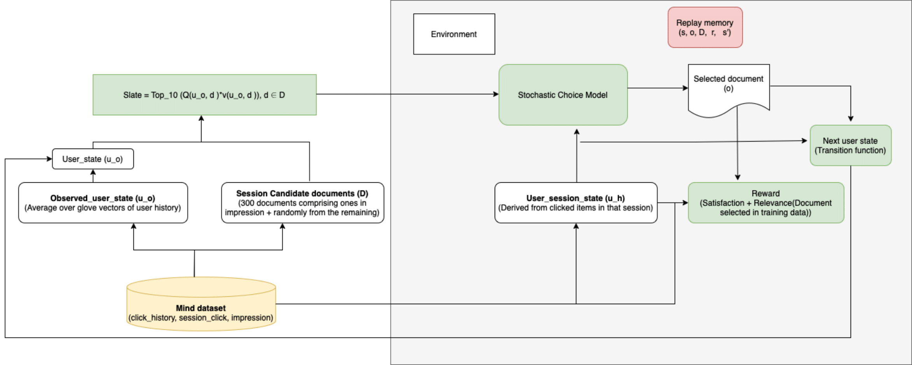

# Leveraging User Diversity for Session-Slate Recommendation via Simulation based Deep Q-Learning
Authors: 
- Aayush Singha Roy (aayush.singharoy@insight-centre.org) 
---

--- 

# Repository setup
To setup the repository clone the github link and run command poetry install from the IDE terminal which will create the .venv file. Ensure that the python environment setup points to python in the.venv file which is in .venv/bin/python

# User model
To run the user model navigate to user_modelling/ncf.py while the dataloader for the user model is setup in the document modelling folder. All the rest user attribute for the reinforcement learning agent is present in user_modelling folder. While all the data preprocessing part that is splitting the data into sessions and setting it up for slate recommendation and train test split is done in mind_dataset/dataset_preprocessing.ipynb. 

# Running Experiments
SlateQ -  To run slateq as described in the paper navigate to src/scripts/simulation/slateq_simulation.py with the seeds as there in the config.yaml file description just after this.
ProtoSlate - To run slatewolpertinger set the nearest neighbour to the percentage of num_candidates (candidate documents as mentioned in the paper) in the config.yaml file. 

# Reproducibility
To ensure reproducibility set the parameters in config.yaml file as mentioned below:
parameters:
parameters:
  ######## User related parameters ########
  resp_amp_factor: 1.0
  state_model_cls: ObservedUserState
  choice_model_cls: NCFChoiceModel
  response_model_cls: WeightedCosineResponseModel
  ######## Environment related parameters ########
  num_users: 5000
  sess_budget: 200
  slate_size: 10
  num_item_features: 50
  num_candidates: 2000
  num_user_features: 20
  alpha_response: 0.0
  ######## Training related parameters ########
  replay_memory_capacity: 2000
  batch_size: 256
  gamma: 1.0
  tau: 0.0001
  lr: 1e-3
  num_episodes: 80000
  warmup_batches: 1
  device: "cpu"  
  ######## Models related parameters ########
  slate_gen_model_cls: TopKSlateGenerator
  ######## Wolpertinger policy ########
  nearest_neighbours: 90
  ######## Seed ########
  seeds: [5, 42, 97, 33, 99]

   For any clarification drop a mail to the developers.