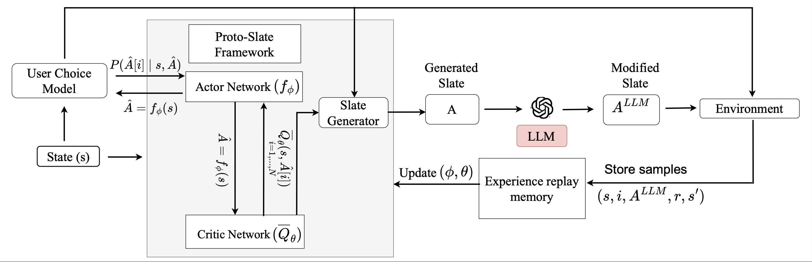

# LLM-Enhanced Session-Aware Slate Recommendation

In this work we explore the use of LLMs reasoning capabilities in slate generation for session based recommender systems. The idea is to retain the performance with LLM enhancement but to also keep the inference time as low as possible. Hence the work is inspired by assessing performance across accuracy, diversity and novelty compared using existing RL slate recommendation algos with LLMs on top of them.
---

--- 

For LLM based inference or training SlateLLM as mentioned in paper set your own API Key in .env file.

# Repository setup
To setup the repository clone the github link and run command poetry install from the IDE terminal which will create the .venv file. Ensure that the python environment setup points to python in the .venv file which is in .venv/bin/python

# Dataset Preprocessing
There are notebooks provided with comments for the data preparation in src/rl_mind_dataset/mind_dataset named as article_data.ipynb which retrieves the glove embeddings for all the news articles while dataset_preprocessing.ipynb provides code for test data split and for identifying entropy diversity for preparing cold start, generalist and specialist users. 

# User model
To run the user model navigate to user_modelling/ncf.py while the dataloader for the user model is setup in the document modelling folder. All the rest user attribute for the reinforcement learning agent is present in user_modelling folder. While all the data preprocessing part that is splitting the data into sessions and setting it up for slate recommendation and train test split is done in mind_dataset/dataset_preprocessing.ipynb. 

# Running Experiments - Training
SlateQ -  To run slateq as described in the paper navigate to src/scripts/simulation/slateq_simulation.py with the seeds as there in the config.yaml file description just after this.
Proto-Slate - To run slatewolpertinger set the nearest neighbour to the percentage of num_candidates (candidate documents as mentioned in the paper) in the config.yaml file. The code to run train this framework is wp_slate_simulation.py
SlateLLM - To run slatewolpertinger set the nearest neighbour to the percentage of num_candidates (candidate documents as mentioned in the paper) in the config.yaml file. The code to run train this framework is wp_slate_llm_simulation.py and make sure the modified_llm_response function in the environment.py file is not commented out during traininig.

# Ablation study - Test runs
For ProtoSlate+LLM and SlateQ+LLM first train the model and then collect test slates by loading the model from wp_slate_gen_collect_slates.py and slateq_gen_slates.py. Next step navigate to llm_slates.py in scripts/serving_tests folder and use llm for generating modified slates and save the result in feather. After that load the feather file in results.ipynb to do the ablations and get results for all metrics. The main notebook to refer is results.ipynb which is in the file plotting_scripts. All the baselines and ProtoSlate reported results in the paper are based on the python test files for each of them in src/scripts/serving_test/. Each file name is indicative of each of the algorithm discussed in the paper. For serving time comparison the code is under src/scripts/serving_time/.

# Plotting Scripts
All plotting scripts are present in src/plotting_scripts/. To produce results in the paper please follow the script in results.ipynb.

# Reproducibility
To ensure reproducibility set the parameters in config.yaml file as mentioned below:
parameters:
  ######## User related parameters ########
  resp_amp_factor: 1.0
  state_model_cls: ObservedUserState
  choice_model_cls: NCFChoiceModel
  response_model_cls: WeightedCosineResponseModel
  ######## Environment related parameters ########
  num_users: 5000
  sess_budget: 200
  slate_size: 10
  num_item_features: 50
  num_candidates: 2000
  num_user_features: 50
  alpha_response: 0.0
  ######## Training related parameters ########
  replay_memory_capacity: 2000
  batch_size: 256
  gamma: 1.0
  lambda: 0.5
  tau: 0.0001
  lr: 1e-3
  num_episodes: 80000
  warmup_batches: 1
  device: "cuda:0"  
  ######## Models related parameters ########
  slate_gen_model_cls: TopKSlateGenerator
  ######## Wolpertinger policy ########
  nearest_neighbours: 90
  ######## Seed ########
  seeds: [5, 42, 97, 33, 99]

   For any clarification drop a mail to the developer.
